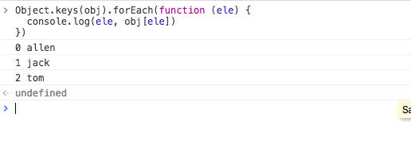

## JavaScript 数组和对象遍历
::: tip 博客
记录程序生涯的点滴，分享技术实践。
:::

## 目录
[[toc]]

::: tip 背景
在前、后端接口调试的时候，或者在某个功能开发的时候，难免会遇到对一个对象数据或者数组数据进行处理，而遍历是其中最为常见的一个处理方式之一。这篇短博客，就来记录一下关于数组和对象遍历的一些方法。
:::

## 一、数组遍历

首先定义一个数组：

```js
var arr = ["allen", "jack", "tom"]
```
### forEach遍历

```js
arr.forEach(function (ele, index, array) {
  console.log(ele, index, array)
})
```

*这边 callback 中有三个参数，ele 表示当前位置上的数据，index 表示当前数据的位置下标， array则是表示当前数组。*

结果如图：


### for...of 遍历
``` js
for (let value of arr) {
  console.log(value)
}
```

for 循环是我们最熟悉不过了，遍历数组返回当前位置数值。

## 二、对象遍历

首先还是定义一个对象

``` js
var obj = {0:"allen", 1:"jack", 2:"tom"}
```

*对象遍历一般用的不多好像，在后台接口数据返回，一般都是约定 json 格式，不会是一个对象去遍历*

一般上面的数据就变成 -> 这样的：

```js
var _json = [
  {"key": 0, "value": "allen"},
  {"key": 1, "value": "jack"},
  {"key": 2, "value": "tom"}
]
```
这样我们在做拼接时，例如 `序号：key，姓名：value`,就比较的熟悉。但既然后台返回的纯对象，那我们也得处理拼接啊，js 很灵活。

### Object.keys()遍历

```js
Object.keys(obj)
```

先来看看 Object.keys 输出的是什么:


是一个数组，并且记录了 key 值，很好，我们可以通过 key 值就能得到对应的 value。用什么方法，就是上面的 forEach 遍历啊。

```js
Object.keys(obj).forEach(function (ele) {
  console.log(ele, obj[ele])
})
```
结果如图：



### for...in遍历

对应的 for...of（返回value）,for...in 则返回的是 key

```js
for (let key in obj) {
  console.log(key, obj[key])
}
```
结果如图：


这些就是关于数组和对象遍历的方法，其实除了封装好一步到位的方法，我们同样可以通过组合的方式，做出想要的效果。
