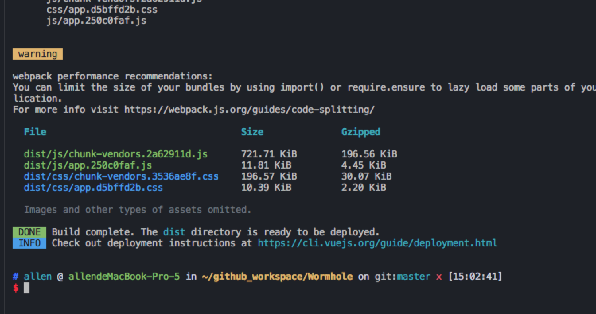
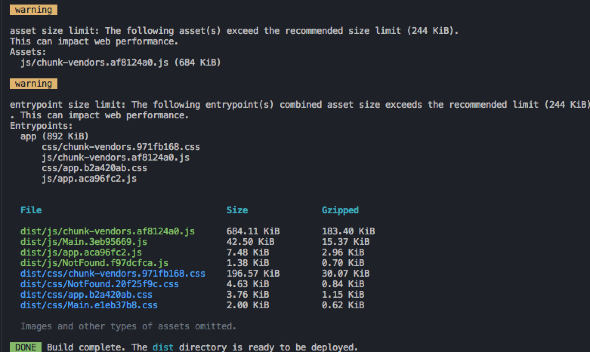

## VUE_CLI 前端性能优化方案
::: tip 博客
记录程序生涯的点滴，分享技术实践。
:::

## 目录
[[toc]]

环境：
`vue-cli 3.4.0`

## 打包优化目的
vue-cli 打包后默认会在 dist 目录下生成静态资源文件，这些文件的大小一般在几 KB 到几百 KB 不等，尤其是 vendor.js 和 app.js。我们会把这些资源部署到服务器中，用于请求。文件越大需要加载的时间也就越长，所以减小文件体积对于网站性能很重要。

`下面的截图是项目未作任何优化的情况`


## 优化方案

### 路由懒加载
`使用路由懒加载后的效果`



从截图中可以看到，css 和 js 分别都从原来的一个变成了现在的 3 个，效果就是所有的文件整体体积变小了。路由懒加载可以理解为延迟加载、按需加载。只有当访问到相应路由时，才会去加载下面的组件。相比于原先一股脑的全部输出，大大降低了首屏的压力。

路由懒加载，利用的是 Webpack 代码分离的特性。此功能能够将代码分离到不同的 bundle 中，获取更小的 bundle，然后可以按需加载这些文件。[参考](https://webpack.docschina.org/guides/code-splitting)

#### 路由懒记载使用代码对比

`非懒加载命名路由`
```js
import Vue from 'vue'
import VueRouter from 'vue-router'

Vue.use(VueRouter)

import Home from 'home/component/path'
import Foo from 'foo/component/path'

const router = new VueRouter({
  routes: [
    { path: '/', name: 'home', component: Home },
    { path: '/foo', name: 'foo', component: Foo },
  ]
})

new Vue({
  router,
    template: `<div id="app"></div>`
}).$mount('#app')
```

`懒加载命名路由`

```js
const Home = () => import(/* webpackChunkName: "Home" */'./views/Home')
const Foo = () => import(/* webpackChunkName: "Foo" */'views/Foo')

const router = new VueRouter({
  routes: [
    { path: '/', name: 'home', component: Home },
    { path: '/foo', name: 'foo', component: Foo },
  ]
})

new Vue({
  router,
    template: `<div id="app"></div>`
}).$mount('#app')
```

`/* webpackChunkName: "Home" */` 决定打包后 dist 文件下生成的这个 bundle 名为 Home.hash.js & Home.hash.css。


### 组件按需加载

组件按需加载，以常用的 ElementUI 来说，我们在开发一个中后台系统的时，可能会用到大概 10 来种里面的组件，但我们习惯会将整个框架资源引入并使用，例如这样：

```js
import Vue from 'vue';
import ElementUI from 'element-ui';
import 'element-ui/lib/theme-chalk/index.css';

Vue.use(ElementUI);
```

`这时候打包出来的资源大小分配如下图`


ElementUI 打包出来非常大，因为这里包含了所有的组件，如果我们能够只打包我们使用了的组件，那文件大小就会变小很多。

`组件按需加载`
- 第一步，借助 `babel-plugin-component`

      npm install babel-plugin-component -D

- 第二步，如果是 vue-cli3.x 配置 `babel.config.js`
```js
module.exports = {
  "presets": [
    '@vue/app',
    [
      "@babel/preset-env",
      {
        "modules": false
      }
    ]
  ],
  "plugins": [
    [
      "component",
      {
        "libraryName": "element-ui",
        "styleLibraryName": "theme-chalk"
      }
    ]
  ]
}
```

- 第三步，按需加载组件，可以全局，可以单独组件引入
```js
import Vue from 'vue';
import { Button, Select, Loading, MessageBox } from 'element-ui';

Vue.component(Button.name, Button);
Vue.component(Select.name, Select);

Vue.use(Loading.directive);
// 也可以添加为实例方法
Vue.prototype.$loading = Loading.service;
Vue.prototype.$msgbox = MessageBox;
```
[参考文档](http://element-cn.eleme.io/#/zh-CN/component/quickstart)

`组件按需加载效果，瞬间降到了 100 kb 内`


### 总结
关于单页面应用，我们一直在谈首屏问题，这也是网站性能的体现。提升一个应用的用户体验，加载速度非常重要，所以我们不但要保证应用功能的稳定性，也要去关注性能表现。上面的两种最简单的方案，就能起到一定的优化作用。
