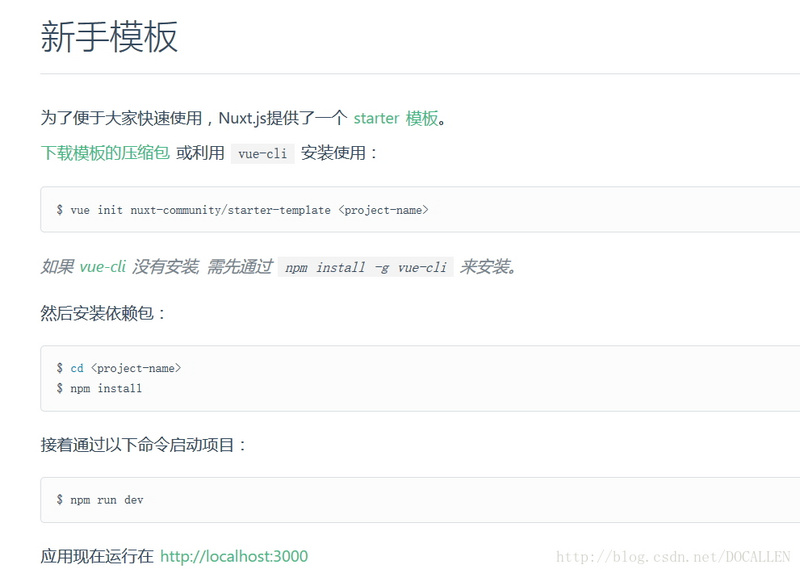
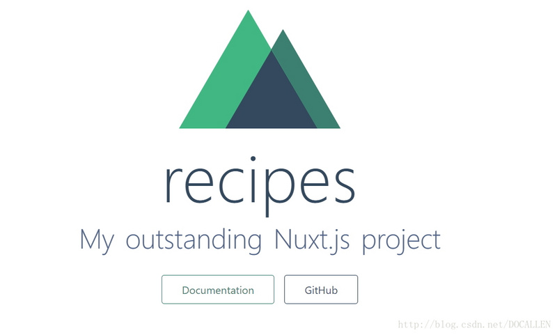
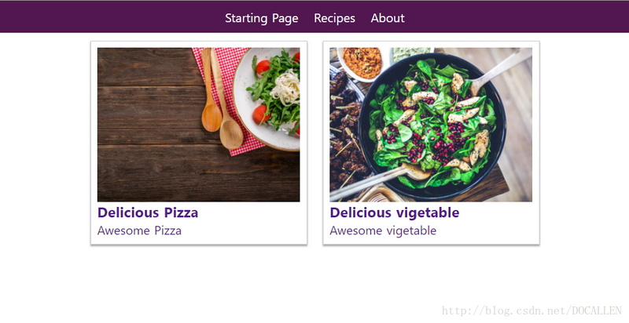
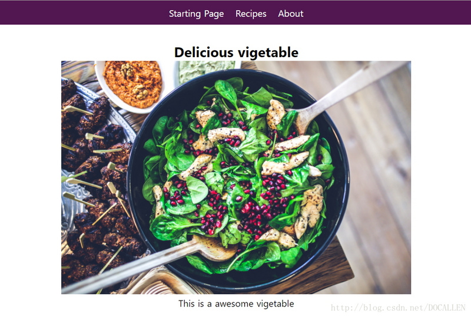
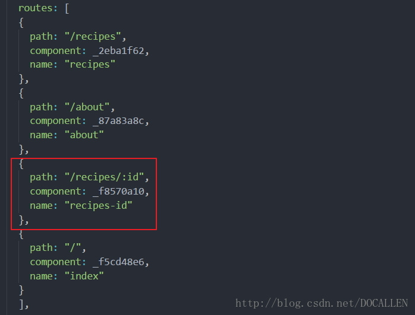

## 基于 Vue.js 的服务端渲染 (ssr) 通用应用框架 Nuxt.js
::: tip 博客
记录程序生涯的点滴，分享技术实践。
:::

## 目录
[[toc]]


*这篇文章旨在通过一个小的 demo, 来回答三个问题：1、什么是 Nuxt.js。2、如何启用一个Nuxt.js 项目。3、如何构建一个通用的 ssr 项目。*

## 一、友情链接


1、[Nuxt.js 官网](https://zh.nuxtjs.org/guide)
2、[Github（Nuxt.js）](https://github.com/nuxt/nuxt.js)
3、[可参考 Demo （nuxt-demo）](https://github.com/AllenChinese/nuxt-demo)
4、[学习视频（YouTube 需翻墙）](https://www.youtube.com/watch?v=nteDXuqBfn0)

## 二、什么是 Nuxt.js

&nbsp;&nbsp;如果你在用 React ,那么你一定知道 React 的服务端渲染应用框架 Next.js 。同样的基于 Vue.js 的 Nuxt.js 也是用于服务端渲染。

&nbsp;&nbsp;我们知道现在非常流行的**客户端渲染**的 web 开发方式，SPA（single page web application）单页应用。我们打包上线，只需要一个 index.html 和一个包含了各种静态资源的 static 文件夹，页面跳转靠路由，所有的东西全在一个 app.js 文件中。

&nbsp;&nbsp;这导致了单页面也存在着缺点：1、首屏加载慢，白屏。2、不利于 SEO。

&nbsp;&nbsp;这里我们就引出了，为什么需要有 Nuxt.js 这样的服务端渲染框架。Nuxt 的出现有效的解决了客户端渲染的单页面上述的两个问题。

&nbsp;&nbsp;[**详细介绍请参考官方文档**](https://zh.nuxtjs.org/guide)


----------


我们来看看客户端/服务端渲染的直观差异吧：

```js
URL:

  客户端：http://localhost:8080/#/findMusicComponent
  服务端：http://localhost:3000/recipes/2

路径的差距体现在，#上。
```
推荐文章：https://segmentfault.com/a/1190000007238999

```js
源代码:

  客户端：
  <body><div id="app"></div><!-- built files will be auto injected --><script type="text/javascript" src="/app.js"></script></body>

  服务端：
  <body data-n-head=""><div data-server-rendered="true" id="__nuxt"><div class="nuxt-progress" style="width:0%;height:2px;background-color:#3B8070;opacity:0;"></div><div id="__layout"><div><header data-v-46cf1d15><nav data-v-46cf1d15><ul data-v-46cf1d15><li data-v-46cf1d15><a href="/" class="nuxt-link-active" data-v-46cf1d15>Starting Page</a></li><li data-v-46cf1d15><a href="/recipes" class="nuxt-link-active" data-v-46cf1d15>Recipes</a></li><li data-v-46cf1d15><a href="/About" data-v-46cf1d15>About</a></li></ul></nav></header><section class="single-recipe"><h1>Delicious vigetable</h1><div class="recipe-image"></div><p>This is a awesome vigetable</p></section></div></div></div><script type="text/javascript">window.__NUXT__={"layout":"default","data":[{"recipe":{"id":"2","title":"Delicious vigetable","previewText":"Awesome vigetable","descriptionText":"This is a awesome vigetable","thumbnail":"https:\u002F\u002Fimages.pexels.com\u002Fphotos\u002F5938\u002Ffood-salad-healthy-lunch.jpg"}}],"error":null,"state":{},"serverRendered":true};</script><script src="/_nuxt/manifest.js" defer></script><script src="/_nuxt/layouts_default.js" defer></script><script src="/_nuxt/pages_recipes__id_index.js" defer></script><script src="/_nuxt/vendor.js" defer></script><script src="/_nuxt/app.js" defer></script></body>

从源代码 body 的差异，就能知道为什么客户端渲染模式的单页面不利于 SEO，内容极少，对浏览器爬虫不友好。
```
推荐文章：https://segmentfault.com/q/1010000009369779/a-1020000009370048

## 三、如何启用一个Nuxt.js 项目

首先，在看这篇文章之前，我认为您已经安装了 Node 和 NPM, 并且有了一定的 Vue 基础。

两种方法：

第一种：
```js
1、npm install create-nuxt-app

2、create-nuxt-app your-app-name
```

可一路回车。

3、初始化完成后，我们会得到这样的目录结构：

每一个文件夹代表的什么，可参考官方文档。

4、package.json 中记录着我们需要的信息，npm run dev 开始我们的 demo 吧

```js
{
  "name": "recipes",
  "version": "1.0.0",
  "description": "My outstanding Nuxt.js project",
  "author": "allen",
  "private": true,
  "scripts": {
    "dev": "nuxt",
    "build": "nuxt build",
    "start": "nuxt start",
    "generate": "nuxt generate"
  },
  "dependencies": {
    "nuxt": "^1.0.0"
  },
  "devDependencies": {
    "cross-env": "^5.0.1"
  }
}
```

第二种：

需要你安装过 vue-cli 官方脚手架，比较懒方法文档中已给出，截图参考。


打开localhost:3000，如果你进行到一下截图的阶段，那么恭喜你，可以正式开发了！


## 四、如何构建一个通用的 ssr 项目

先来看一下 demo 的截图吧：





**大体的结构：三个一级栏目（开始页、菜单栏、关于页），一个二级菜单（每道菜的详情页）。**

在这边主要想讲一下，动态路由实现根据菜品的 id 参数跳转详情页。这和我们平时想法是一致的：首先在菜单栏中，点击某一个菜品，拿到对应的 id，然后跳转到详情页，向服务端进行异步请求，获取对应的 id 的菜品详情资料，最后在前端进行数据渲染。

```js
我们需要实现的效果可以在 URL 上体现：

  菜单栏：http://localhost:3000/recipes
  Vigetable：http://localhost:3000/recipes/2
  Pizaa：http://localhost:3000/recipes/1

```

官网上对于动态路由有这样的一段：


ok,现在我建一个以下划线为开头的详情的目录：


*_id 为详情目录，所有目录中的 index.vue 都是默认首页。

**详情页源码：**

```js
/**
 * @Description: recipe
 */
<template>
  <section class="single-recipe">
    <h1>{{ recipe.title }}</h1>
    <div class="recipe-image">
      
    </div>
    <p>{{ recipe.descriptionText }}</p>
  </section>
</template>

<script>
export default {
  /**
   * @description data from server
   */
asyncData (context) {
  return new Promise((resolve, reject) => {
    setTimeout(() => {
	  resolve({
		recipe: [{
		  id: '1',
		  title: 'Delicious Pizza',
	          previewText: 'Awesome Pizza',
	          descriptionText: 'This is a nice Pizza',
	          thumbnail: 'https://static.pexels.com/photos/326278/pexels-photo-326278.jpeg'
	          },
		  {
		  id: '2',
		  title: 'Delicious vigetable',
	          previewText: 'Awesome vigetable',
	          descriptionText: 'This is a awesome vigetable',
	          thumbnail: 'https://images.pexels.com/photos/5938/food-salad-healthy-lunch.jpg'
		  }].find(el => el.id === context.params.id)
		});
      }, 1500)
    })
  }
}
</script>

<style>
.single-recipe
{
  display: flex;
  flex-flow: column;
  justify-content: center;
  align-items: center;
  text-align: center;
  padding: 30px;
}
.recipe-image img
{
  width: 80%;
}
</style>


```
关键点就是 context.params.id，这就是每个菜品的 id，我这边是 new Promise 异步请求数据，正式的你是通过拿到 id，请求后台该 id 下唯一的详情数据。

看一下动态路由下 build 出来的 router.js 部分：



结论：只要根据 Nuxt.js 提供的路由规范，会让页面路由切换很轻松。

最后在发一下 Github 上的完整 Demo：[可参考 Demo （nuxt-demo）](https://github.com/AllenChinese/nuxt-demo)

结语：希望我的文章能让你了解一些关于 Nuxt.js 的内容，或者开始认识 Nuxt.js。文章比较浅，如果你在未来想将服务端渲染应用到项目中，官方文档你需要详看。


